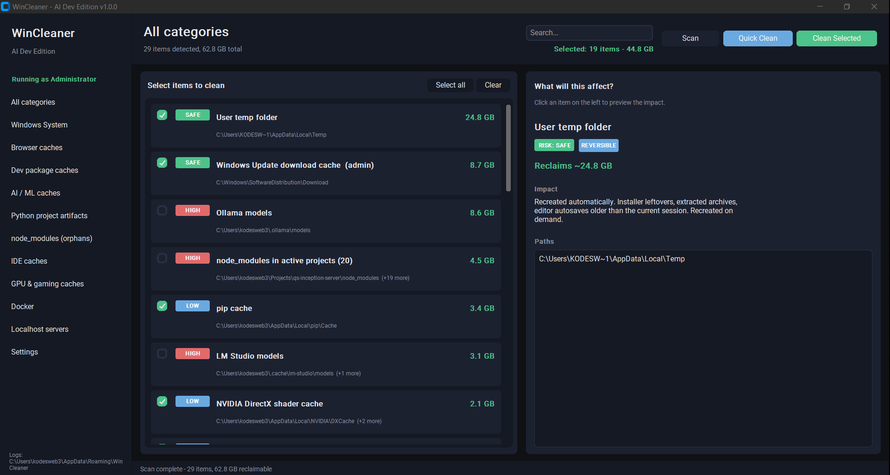
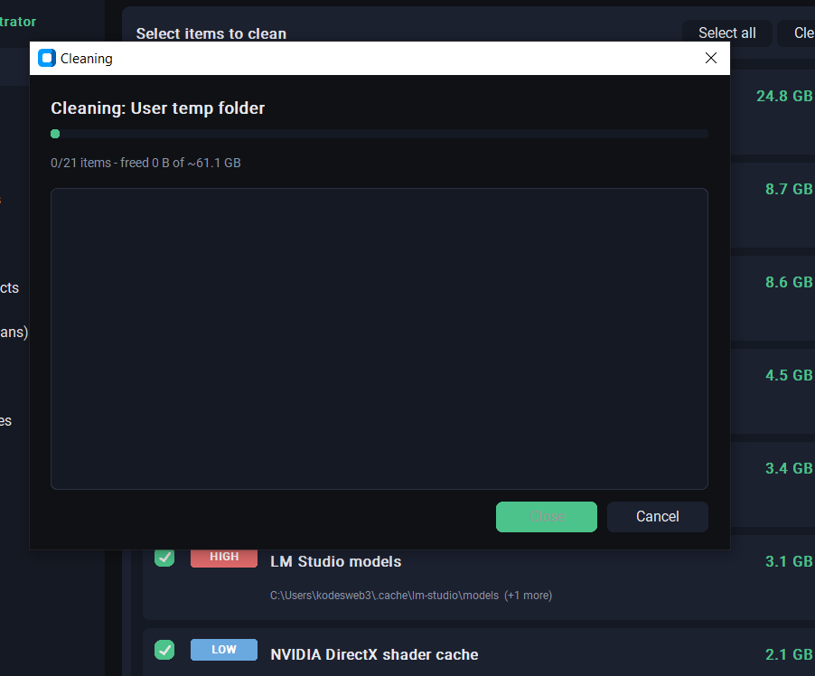
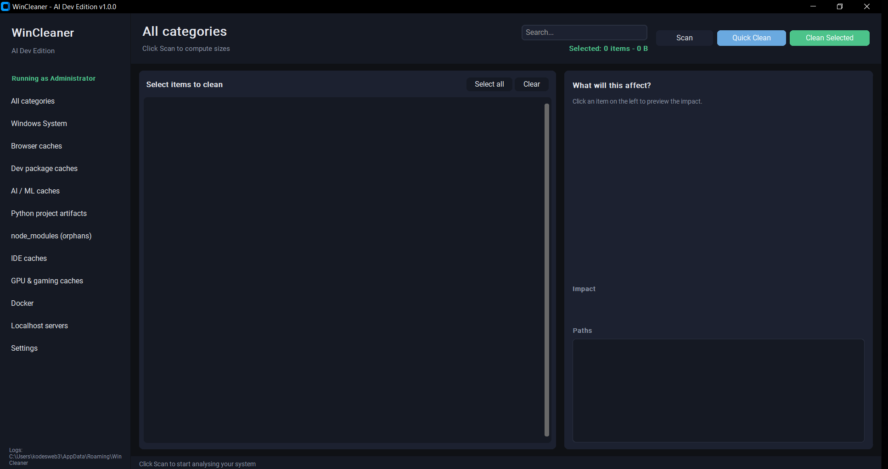

<div align="center">

# DevCleaner for Windows

### *Your disk called. It said “please stop hoarding 40GB of Hugging Face weights.”*

[](LICENSE)
[](https://www.python.org/downloads/)
[](https://github.com/broiscodingtpc/devcleaner-win)
[](https://github.com/broiscodingtpc/devcleaner-win)

**A friendly, opinionated desktop cleaner for developers who ship code, run AI, and somehow still have three copies of `node_modules` from 2019.**

[Features](#features) · [Screenshots](#screenshots) · [Quick start](#quick-start) · [Safety](#safety) · [Build exe](#build-exe) · [Contributing](#contributing)

</div>

---

## Screenshots

<p align="center">
  <br/>
  <sub>Main window with scan results and risk badges</sub>
</p>
<br/>
<p align="center">
  <br/>
  <sub>Cleaning interface in action</sub>
</p>
<br/>
<p align="center">
  <br/>
  <sub>Specific categories like AI and Dev Stacks</sub>
</p>

---

## Why this exists

You’ve got **npm caches**, **pip wheels**, **Ollama blobs**, **`__pycache__` forests**, **Cursor eating your SSD**, and a **`localhost:5173` from last Tuesday** that refuses to die.  
Windows Disk Cleanup doesn’t know what a *transformers* cache is. **DevCleaner does.**

- **See what you’re nuking** — every item has a risk badge and a plain-English “what will this break?” panel.
- **Pick your chaos level** — Quick Clean only touches `Safe` + `Low` by default; `High` stays unchecked until *you* say so.
- **Ghost servers begone** — a **Localhost** tab lists listeners, flags sketchy dev ports, and lets you kill the stragglers.

> **Note:** UI and code strings are **English** (easier for contributors and issues). Issues & PRs in any language are welcome.

---

## Features

| | |
|:---|:---|
| **Risk levels** | `Safe` → `High` — green to red, no surprises |
| **Detail panel** | Paths, size, reversibility, “will this regenerate?” |
| **Live totals** | Watch reclaimable space update as you tick boxes |
| **Quick Clean** | One click: select only Safe + Low |
| **Dry run** | Settings: simulate deletes, touch nothing |
| **Recycle Bin first** | `send2trash` by default; permanent delete is opt-in |
| **Admin mode** | One-click relaunch with UAC for system folders |
| **Localhost radar** | TCP listeners on loopback / `0.0.0.0`, kill forgotten dev servers |
| **Logs** | Rotating logs under `%APPDATA%\WinCleaner\logs\` |

---

## What gets cleaned (high level)

| Bucket | Examples |
|:---|:---|
| **Windows** | `%TEMP%`, Windows Temp, Prefetch, Update download cache, WER, thumbnails, Recycle Bin, `Windows.old` (opt-in) |
| **Browsers** | Chrome / Edge / Brave / Opera / Vivaldi / Firefox — **cache only** (not passwords, cookies, or history) |
| **Dev stacks** | npm, pnpm, Yarn, pip, Poetry, cargo, Maven, Gradle, Go modules, NuGet, … |
| **AI / ML** | Hugging Face hub, PyTorch, TensorFlow, Whisper, Ollama / LM Studio (high-risk, off by default), … |
| **Python junk** | Recursive `__pycache__`, `.pytest_cache`, `.mypy_cache`, `.ruff_cache`, `.tox`, … |
| **node_modules** | Finds folders; splits “probably orphan” vs “still active” |
| **IDEs** | VS Code, Cursor, JetBrains caches / logs / stale workspace storage |
| **Gaming / GPU** | NVIDIA / AMD shader caches, DirectX, Steam shader cache |
| **Docker** | `docker system prune` / builder prune (if Docker CLI is available) |

---

## Safety

This is **not** “delete `C:\Windows` and hope.” Every path goes through **`app/core/safety.py`**:

- Allow-list prefixes (temp dirs, AppData caches, etc.)
- Deny-list for the scary stuff (`System32`, `Program Files`, user `Documents`/`Desktop`/media roots — except explicitly whitelisted nested dev artifacts)

**High-risk entries start unchecked.** Big jobs or Medium/High risk trigger a confirmation. **You** stay in the loop.

---

## Quick start

### Clone

```bash
git clone https://github.com/broiscodingtpc/devcleaner-win.git
cd devcleaner-win
```

*(If your folder is still named `windows-cleaner` from a local copy, that’s fine — same code.)*

### Run from source

```bash
python -m venv .venv
.venv\Scripts\activate
pip install -r requirements.txt
python main.py
```

Or double-click **`run-dev.bat`** (no UAC, good for hacking).

### Run with admin prompt

**`run.bat`** sets up the venv and launches with **`RunAs`** so Windows can ask for elevation.

### Build `.exe`

```bash
build.bat
```

Output: **`dist\WinCleaner.exe`** (PyInstaller, `--uac-admin`).

**Requirements:** Windows 10/11, Python **3.10+** for dev; the frozen `.exe` has no Python runtime dependency.

---

## Project layout

```
main.py
app/
  ui/           # CustomTkinter — main window, scan list, ports, settings
  core/         # scanner, executor, safety, logging, settings
  categories/   # Windows, browsers, dev, AI, Python, node_modules, IDEs, gaming, Docker
  net/          # localhost listener analysis
```

---

## Contributing

PRs and issues are **welcome**. Bug reports with **Windows version**, **Python version**, and **what you clicked** help a lot.

1. Fork the repo  
2. Create a branch: `git checkout -b feat/amazing-thing`  
3. Commit with a clear message  
4. Open a Pull Request  

Please keep destructive logic behind **`safety.py`** — we’re cleaning disks, not souls.

---

## Disclaimer

**Use at your own risk.** This tool can delete large amounts of data. Read the labels. When in doubt, use **Dry run** first. The authors are not responsible for lost homework, deleted `node_modules` you still needed, or emotional damage from seeing your true `pip` cache size.

---

## License

**MIT** — see [LICENSE](LICENSE).

---

<div align="center">

**Star the repo** if this saved you a trip to buy a bigger NVMe.

Made with too many tabs open and not enough disk space.

</div>
